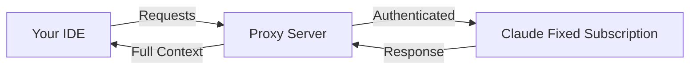

# 🚀 Cursor-Claude Connector

> **Maximize your Claude subscription**: Use Claude's full power in your favorite IDE (like Cursor)

## 🚀 Why use your Claude subscription in an IDE?

Get the best of both worlds by combining Claude's capabilities with a professional development environment:

### 💡 **Claude's Full Capabilities**

- Direct access to Claude's latest models and features
- No token limits from your Claude Max subscription
- Full context understanding without compression
- Handle large files and complex projects seamlessly

### 🛠️ **Professional IDE Experience**

- **Code-first interface**: Built specifically for development workflows
- **File management**: Navigate and edit multiple files effortlessly
- **Version control**: Full git integration and change tracking
- **Extensions & tools**: Access to your IDE's ecosystem

### 💰 **Maximize Your Investment**

- Already paying for Claude Max? Use it everywhere
- No additional API costs or usage limits
- One subscription, multiple environments
- Full value from your Claude subscription

### 🎯 **Perfect for Complex Projects**

- Maintain context across entire codebases
- Work with large files without restrictions
- Extended coding sessions without interruptions
- Professional development workflow

## ⚠️ **Important: Cursor Requirements**

> **Note**: Cursor requires at least the $20/month plan to use agent mode with custom API keys (BYOK - Bring Your Own Key). The free tier only supports basic completions.

## 🔧 How does this project work?

This proxy enables you to use your Claude Max subscription directly in IDEs that support OpenAI-compatible APIs:

- ✅ Your favorite IDE's interface and features
- ✅ Claude's full capabilities from your subscription
- ✅ No additional costs beyond your Claude Max subscription

### Architecture



## 🚀 Quick Installation

### 🔥 One-Click Deploy to Vercel

Deploy instantly with Upstash Redis integration:

[](https://vercel.com/new/clone?repository-url=https://github.com/Maol-1997/cursor-claude-connector&env=API_KEY&envDescription=Custom%20optional%20key%20for%20enhanced%20security%20protection&envLink=https://github.com/Maol-1997/cursor-claude-connector%23api-key&integration-ids=oac_V3R1GIpkoJorr6fqyiwdhl17)

<!-- The integration-ids parameter includes Upstash's official Vercel integration ID for automatic Redis setup -->

This will:

- ✅ Deploy the proxy to Vercel
- ✅ Automatically create an Upstash Redis database
- ✅ Configure all environment variables (including optional API_KEY)
- ✅ Get you running in under 2 minutes!

### 📖 Manual Setup Guide

For detailed instructions or alternative deployment methods, see our **[Deployment Guide](DEPLOYMENT.md)**.

### Local Development
NOTE: For local deployment, we need ngrok because Cursor's cloud agent cannot reach your localhost; it requires a publicly reachable HTTPS endpoint. We use ngrok to expose the local proxy so Cursor can talk to it. If you skip ngrok, Cursor cloud calls to your local server will fail; only purely local clients (like curl) would work.

1) **Clone the repository**
```bash
git clone https://github.com/Maol-1997/cursor-claude-connector.git
cd cursor-claude-connector
```

2) **Configure `.env`**
```bash
cp env.example .env
```
Fill at least:
- `UPSTASH_REDIS_REST_URL`
- `UPSTASH_REDIS_REST_TOKEN`
- `API_KEY` (optional; this is the key you will give to Cursor. Make it up.)
- `NGROK_DOMAIN` (your reserved ngrok domain, e.g. sensitive-cheryle-unwillfully.ngrok-free.dev)

Optional toggles:
- `FORCE_THINKING_BUDGET` (If thinking is not set in the source request, forces thinking to this token budget. Budget is auto-shrunk to fit 64k cap.)
- `FORCE_MAX_TOKENS` (forces outgoing max_tokens to this number, regardless of the source request's max_tokens value. Capped at 64k.)
- `LOG_REQUEST_DEBUG` (writes source and forwarded request bodies to `logs/requests.log`)

2a) **Install ngrok (for local tunneling)**
```bash
brew install ngrok
```
- Create a free ngrok account
- Add your authtoken using:
```bash
ngrok config add-authtoken <TOKEN>
```
- Claim a static domain (e.g. `yourname.ngrok-free.dev`) from the Web UI (Universal Gateway -> Domains)
- Put your static domain in `NGROK_DOMAIN` in `.env`

3) **Run the start script** (starts proxy + ngrok, cleans up on exit)
```bash
./start.sh
```
If ngrok isn't configured, the script will warn and only start the proxy locally.

4) **Authenticate with Claude**
Open `http://localhost:9095/` and complete the OAuth flow (saves tokens to Upstash).

5) **Configure Cursor**
- Settings → Models → Override OpenAI Base URL:
  - If using ngrok: `https://<NGROK_DOMAIN>/v1`
  - If you skipped ngrok: `http://localhost:9095/v1`
- API key: use `API_KEY` from `.env` if you set one (otherwise leave blank).

## 🎉 Advantages of this solution

| Feature                 | Claude Web | Claude Code | **This Project**        |
| ----------------------- | ---------- | ----------- | ----------------------- |
| IDE Integration         | ❌         | ❌ Terminal | ✅ Full IDE             |
| File Management         | ❌         | ✅          | ✅ IDE Native           |
| Claude Max Usage Limits | ✅         | ✅          | ✅ No Additional Limits |
| Version Control         | ❌         | ⚠️          | ✅ Full Git Integration |
| Development Extensions  | ❌         | ❌          | ✅ IDE Ecosystem        |
| Cost                    | Claude Max | Claude Max  | Claude Max Only         |

## 🔐 API Key (Optional)

You can optionally set an `API_KEY` environment variable for additional security:

- If set, Cursor must provide this key in the API key field
- Adds an extra layer of authentication to your proxy
- Useful when deploying to public URLs
- Leave empty to use without additional authentication

## 🛡️ Security

- Uses your existing Claude session for authentication
- Optional API key for additional security
- Local connection between Cursor and the proxy
- Open source code for auditing

## 🤝 Contributions

Contributions are welcome! If you find any issues or have suggestions, please open an issue or PR.

## 📄 License

MIT - Use this project however you want

---

**Note**: This project is not affiliated with Anthropic or Cursor. It's a community tool to improve the development experience.
